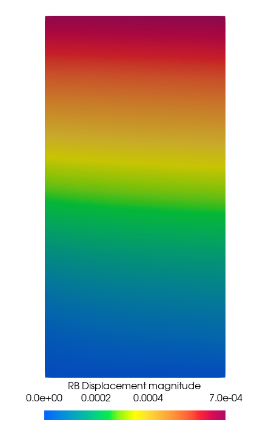
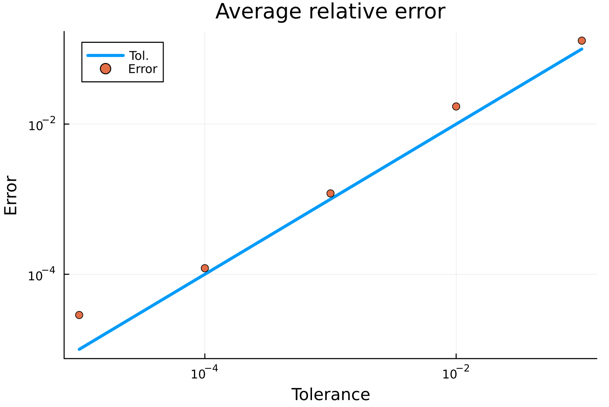
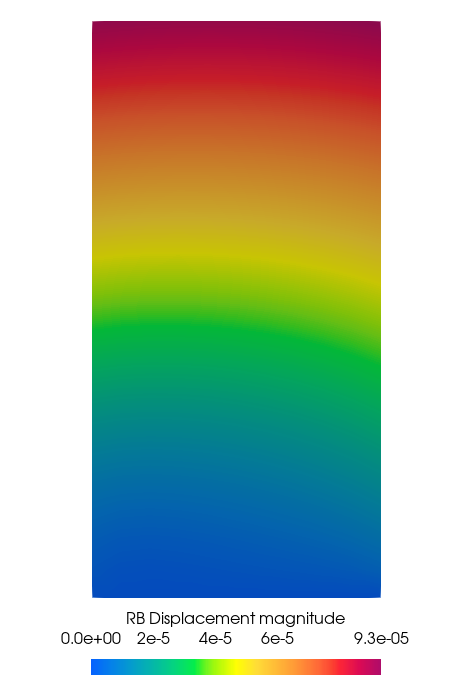
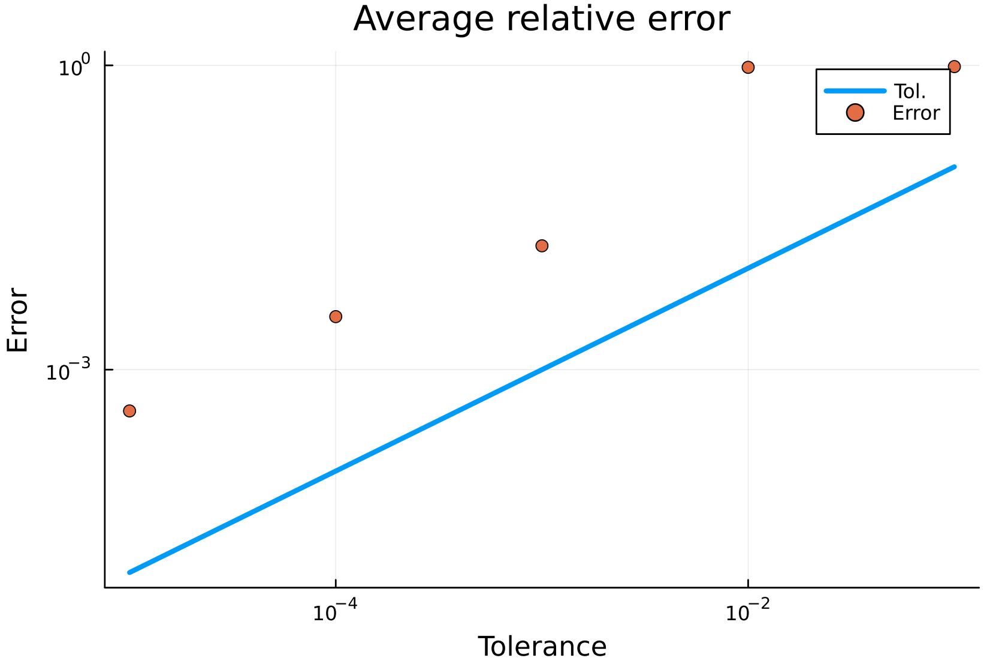
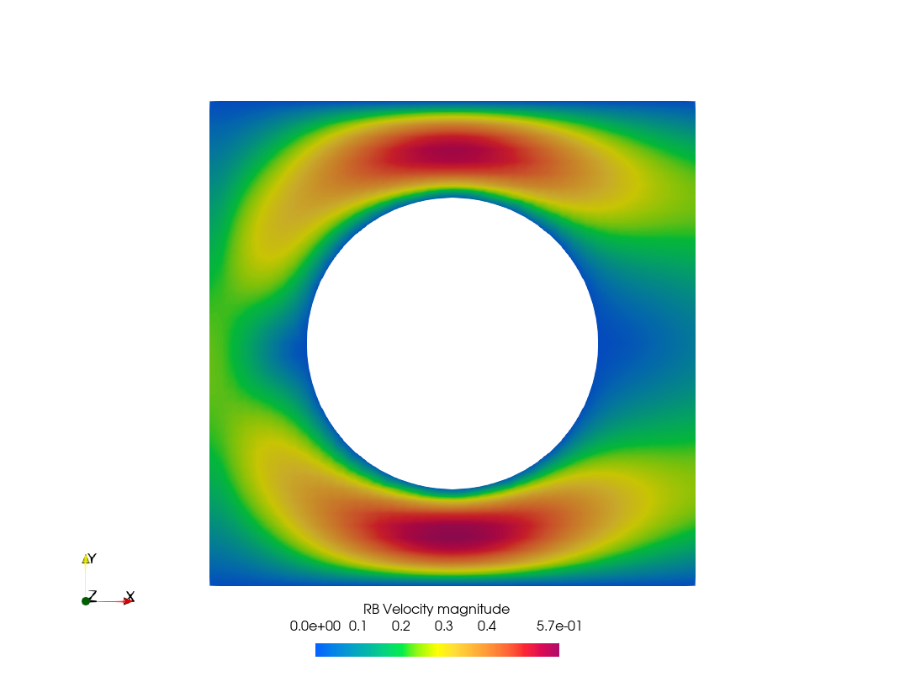
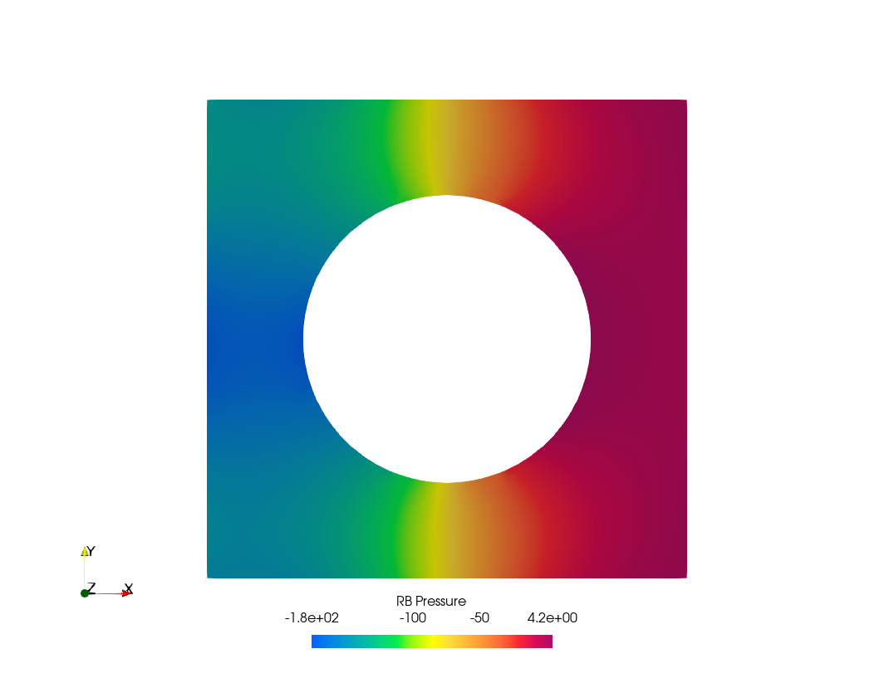

# ROManifolds

This package provides a set of tools for the solution of parameterized partial differential equations (PDEs) with reduced order models (ROMs). The presence of parameters severely impacts the feasibility of running high-fidelity (HF) codes such as the finite element (FE) method, because typically the solution is required for many different values of the parameters. ROMs create surrogate models that approximate the solution manifold on a lower-dimensional manifold. These surrogates provide accurate solutions in a much shorter time and with much fewer computational resources. The library is developed in close collaboration with [Gridap.jl](https://github.com/gridap/Gridap.jl).

| **Documentation** |
|:------------ |
| [](https://nichomueller.github.io/ROManifolds.jl/dev/) |
| **Citation** |
| [](https://github.com/nichomueller/rb_julia) |
|**Build Status** |
| [](https://github.com:nichomueller/ROManifolds.jl/actions?query=workflow%3ACI) [](https://codecov.io/gh/github.com:nichomueller/ROManifolds.jl) |

## Installation

```julia
# Type ] to enter package mode
pkg> add ROManifolds
```

## Examples

Before running the following examples, it is necessary to import from file some geometries which can be found [here](https://nichomueller.github.io/ROManifolds.jl/docs/assets). The file name is `models.zip`. The geometries must be unzipped and moved to a directory where the numerical experiments are ran. This directory should be placed inside the `data` directory of the `Julia` project which is being used to run these experiments. To find this directory, first add the package `DrWatson` with 

```julia
# Type ] to enter package mode
pkg> add DrWatson
```

and call

```julia
julia> test_dir = datadir()
```

Now we can unzip the compressed folder in `dir` with 

```julia
julia> model_dir = joinpath(@__DIR__,"docs/src/assets")
# Type ; to enter shell mode
shell> unzip $model_dir/models.zip -d $test_dir
```

In the following numerical examples, we provide a plot of the convergence errors for a series of tolerances (which determine the accuracy of the method), and a solution plot obtained with a fixed tolerance of `1e-5`.

### Test 1 

Solve a steady elasticity problem with a proper orthogonal decomposition algorithm. 

```julia
julia> include("examples/SteadyElasticityPOD.jl")
```
Solution             |  Convergence
:-------------------------:|:-------------------------:
  |  

### Test 2

Do the same, but with a tensor-train decomposition approach.

```julia
julia> include("examples/SteadyElasticityTTSVD.jl")
```
Solution             |  Convergence
:-------------------------:|:-------------------------:
  |  

### Test 3

Solve a steady Stokes equation with a proper orthogonal decomposition algorithm.

```julia
julia> include("examples/SteadyStokesPOD.jl")
```

Solution-velocity          |  Solution-pressure        |  Convergence
:-------------------------:|:-------------------------:|:-------------------------:
  |    |   

### Test 4 

Moving to transient applications, we first solve a heat equation with a space-time RB method.

```julia
julia> include("examples/HeatEquationSTRB.jl")
```

Solution             |  Convergence
:-------------------------:|:-------------------------:
  |   

### Test 5

Lastly, we solve a Navier-Stokes equation with a space-time RB method.

```julia
julia> include("examples/NStokesTransientSTRB.jl")
```

<!-- |  |  -->
